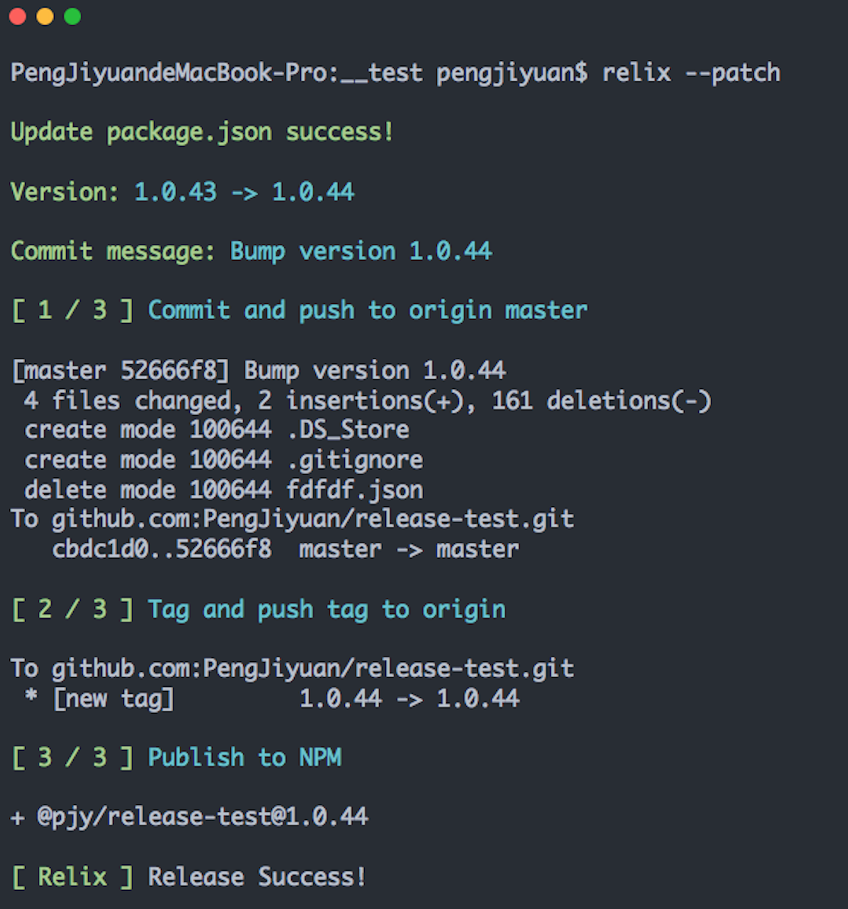

[](https://travis-ci.org/PengJiyuan/relix)
[](https://www.npmjs.com/package/relix)
[](https://www.npmjs.com/package/relix)


# Relix
一个全自动 NPM 包发布工具.

Relix 根据 ([SemVer规范](https://semver.org/)) 自动生成新版本号, 然后帮你自动生成commit message，打tag，推到GitHub，发布到 NPM !

[English Document](./README.md)

## 使用截图



## 为什么会有Relix这个项目?

当我们发布一个新的包到 NPM 的时候，我们需要做以下的工作:

* 手动改变`package.json`中的版本号.
* `git add` 更改并且 `git commit` 生成一个新提交。通常我们需要有一个像 `bump version 1.1.1` 这样的commit message。
* 通过 `git push` 推送本地提交到远程Github.
* 基于我们的新版本号打个新tag.
* 推送这个tag到远程Github.
* 通过 `npm publish` 把新版本的包推送到NPM.

额... 好烦人有木有! 而且整个过程中的所有信息（新版本号的确认，commit message，tag）都需要自己手动填写，容易出错不说，还很麻烦！

所以，这就是 **Relix** 出现的原因!

## Relix 可以帮你做什么?

* 根据 [SemVer规范](https://semver.org/)自动生成新版本号.

  你不用浪费时间去手动确认版本号，Relix会根据你想要的发布类型自动确认版本号，**MAJOR.MINOR.PATCH.BETA**， 全自动化！

* 根据 **新版本的类型** 自动生成Commit message.

  比如, 当你使用 `relix --patch`, 会生成这样一个提交信息 `Bump version x.x.x`.

  当你使用 `relix --prerelease alpha`, 会生成这样一个提交信息 `Prerelease alpha version x.x.x-alpha.0`.

  听起来不错对不对！

* 推送提交到远程Github，并且根据新版本号打个tag，然后把这个tag推送到远程Github。

* 最后，Relix会帮你把完全标准化的一个包发布到 NPM 上!

## 使用方法

```bash
# 全局安装relix
npm i relix -g
# 或者本地安装relix
npm i relix -D
```

```bash
## 输出relix的使用方法
relix -h
```

以下是`relix -h`的输出：

```
  Usage: relix [options]

  Version format: MAJOR.MINOR.PATCH (see: https://semver.org/)

  Options:

    -v, --version              output the version number
    --patch                    version when you make backwards-compatible bug fixes.
    --minor                    version when you add functionality in a backwards-compatible manner
    --major                    version when you make incompatible API changes
    --prepatch [identifier]    increments the patch version, then makes a prerelease (default: beta)
    --preminor [identifier]    increments the minor version, then makes a prerelease (default: beta)
    --premajor [identifier]    increments the major version, then makes a prerelease (default: beta)
    --prerelease [identifier]  increments version, then makes a prerelease (default: beta)
    --accessPublic             npm publish --access=public
    -m, --remote [remote]      remote and branch. format: `upstream/branch`
    -h, --help                 output usage information
  
  Tip:

    You should run this script in the root directory of you project or run by npm scripts.

  Examples:

    $ relix --patch
    $ relix --prepatch
    $ relix --prepatch alpha
    $ relix --major --accessPublic
    $ relix --patch --remote upstream/branch

```

## 命令的使用方法

比如，你当前的版本是 **1.1.1**

以下命令的格式都是 `relix [option]`。

| option                   | 新生成的版本号    | 自动生成的提交信息 | 解释        |
|--------------------------|-----------------|----------------|-------------|
| `--patch`                | `1.1.2`         | Bump version 1.1.2 | 如果你做了一些向后兼容的bugfix，那么你用这个命令。 |
| `--minor`                | `1.2.0`         | Release minor version 1.2.0 | 如果你新增了一些功能，但是没有做api上的改动，<br>向后兼容，那么你用这个命令. |
| `--major`                | `2.0.0`         | Release major version 2.0.0 | 如果你改api并且不向后兼容了，那么你用这个命令 | 
| `--prepatch alpha`       | `1.1.2-alpha.0` | Prerelease alpha version 1.1.2-alpha.0 | 如果你做了一些向后兼容的bugfix，<br>然后想发布一个预发布版本，那么你用这个命令. | 
| `--preminor rc`          | `1.2.0-rc.0`    | Prerelease rc version 1.2.0-rc.0 | 如果你新增了一些功能，但是没有做api上的改动,<br>然后想发布一个预发布版本，那么你用这个命令. | 
| `--premajor`             | `2.0.0-beta.0`  | Prerelease beta version 2.0.0-beta.0 | 如果你改api并且不向后兼容,<br>然后想发布一个预发布版本，那么你用这个命令. |
| `--prerelease`           | `1.1.2-beta.0`  | Prerelease beta version 1.1.2-beta.0 | 等同于 `--prepatch`. |
| `--patch --accessPublic` | `1.1.2`         | Bump version 1.1.2 | 如果你的 NPM 包是私有包，比如你的包名称叫`@yourname/packageName`<br>，那么在发布时候需要使用`npm publish --access=public`来发布，<br>这个时候你需要使用`--accessPublic` |
| `--patch --remote upstream/mybranch` | `1.1.2`         | Bump version 1.1.2 | 用于指定远程和分支 |

## Node API

### relix(options)

`options` `<Object>`
* `patch` `<boolean>`
* `minor` `<boolean>`
* `major` `<boolean>`
* `prepatch` `<boolean|string>`
* `preminor` `<boolean|string>`
* `premajor` `<boolean|string>`
* `accessPublic` `<boolean>`
* `remote` `<string>`

### usage

```js
const relix = require('relix');
relix({
  path: true,
  accessPublic: true,
  remote: 'upstream/mybranch'
}).then(
  () => console.log('Publish success...'),
  () => process.exit(1)
);
```

## LICENSE

[MIT](./LICENSE) © PengJiyuan
